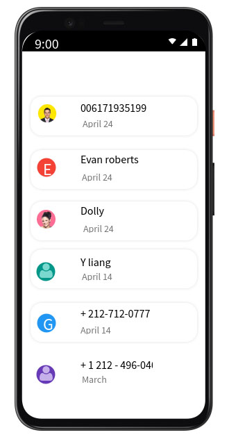
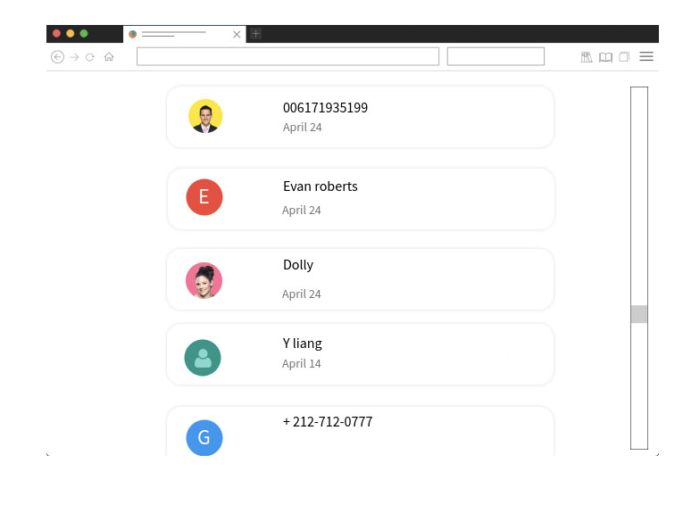
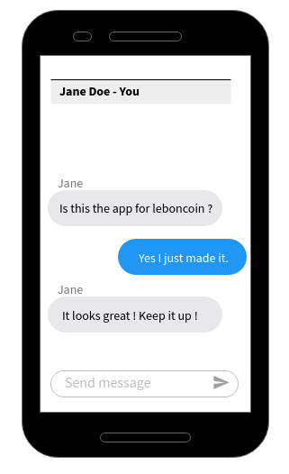
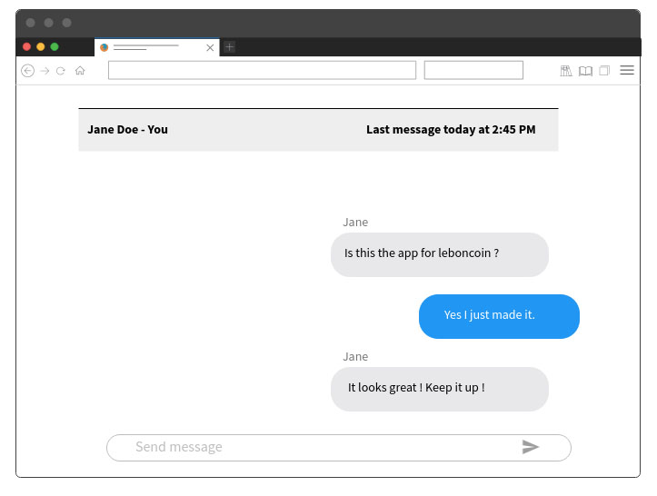

# Context :

At leboncoin, our users can share some messages about a transaction, or ask for information about any sold products.

Your job is to create the interface to consult those messages.
The interface needs to work on both desktop & mobile devices.

In addition to your code, a README explaining your thought process and your choices would be appreciated.

# Exercice :

- Display a list of all the conversations
- Allow the user to select a conversation
  - Inside the conversation, there is a list of all the messages between these two users.
  - As a user, you can type and send new messages in this conversation

**As your application can be used by millions of users, make sure to provide some robust safety guards.**

### Sketches :

Obvisouly, it is up to you to make something nice and pretty. The sketches are here to give you an idea on how it should looks.

  
Click to see the sketches

  
Mobile list :

Desktop list :

Mobile conversation :

Desktop conversation :

### API :

Swagger

---

## Bonus 1 :

We provide some conversation samples, but can you improve the app so the user can now create new conversations ?

## Bonus 2 :

Our infrastructure is a bit shaky.. Sometimes the servers are crashing. “It’s not you, it’s me”, but maybe you can display something nice to warn the user.

## Do you want to make the app even better ?

Feel free to make as many improvements as you like.
We love creativity and technical challenges.

If you are out of ideas, here are some thoughts :

- Now that your app is great and beautiful, wouldn’t it be better if it was more secure ?
  Everybody can read and send messages on your behalf.

  The provided APIs allow you to pass a cookie parameter, can you make some modifications to make it work ?

- As we want our user anywhere, we need to make sure the app is performing well. What can you do to make it blazing fast ?

- Our goal is to reach everybody in the country, including people with disabilities. As a good citizen and a good developer, can you make sure the app is accessible for everyone ?

- We all love to relax after a hard day’s work. It would be a shame if we didn’t feel confident enough about the upcoming automatic deployment. Are you sure everything has been tested thoroughly ?
